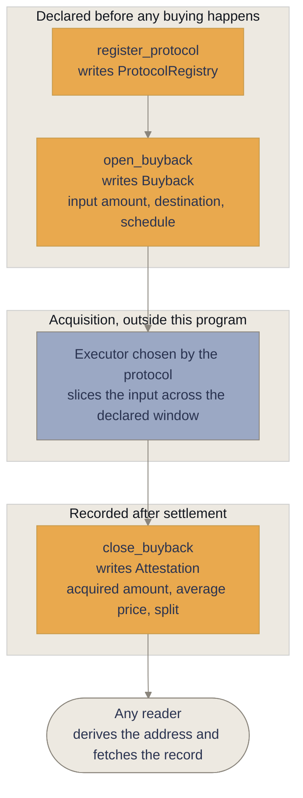
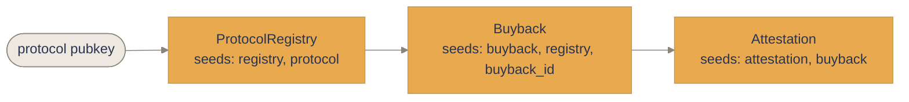

<p align="center">
  
</p>

<h1 align="center">Bybak</h1>

<p align="center">
  <strong>Solana's Verifiable Buyback Standard.</strong><br/>
  <em>Revenue flies home.</em>
</p>

<p align="center">
  <a href="https://bybak.fi"></a>
  <a href="https://x.com/bybak_fi"></a>
  <a href="https://github.com/bybakfi"></a>
  <a href="https://explorer.solana.com/address/8n1BA3TB1tfYzU75GR9CDePXZEeoXXEYQVEs3QqwTRrj?cluster=devnet"></a>
</p>

<p align="center">
  
  
  
</p>

<p align="center">
  
  
  
  
</p>

---

## Overview

A protocol earns fees. It announces that some of those fees were used to buy its own
token back. That sentence is usually true, and it is almost never checkable, because
the only party who can tell you where to look is the party making the claim.

Bybak is a proposal for how to write that down instead. It describes how a buyback
executes and how the execution reads afterward: an identifier issued before the buying
starts, an accumulation sliced across a window declared in advance, a destination
declared before the tokens move, and a completion record published in one schema so
that returns from different protocols can be laid side by side.

The metaphor the project is named for is a racing pigeon. The ring goes on the leg
before the bird can fly, and it cannot come off afterward. Nobody asks the bird where
it has been. Somebody reads the ring. A buyback should work the same way: not a
promise that revenue came home, but a number on its leg saying which return it was.

Three things follow from taking that seriously.

- **Band.** Every execution carries an identifier issued before the acquisition
  begins, bound to exactly one return. It cannot be attached afterward to something
  that already happened.
- **Loft.** The destination is declared before the buy, not explained after it.
  A destination chosen once the outcome is known is a different object entirely.
- **Feed.** A completed return is published in one schema, so two protocols'
  records can sit next to each other and be read at a glance.

This repository holds the specification draft and the reference Anchor program that
implements it, deployed to Solana devnet against a program id anyone can inspect.
What the standard costs is nothing. The schema is public and stays public, and
implementing it requires no permission and no relationship with anyone.

## The problem

Consider what actually happens today when a protocol says it executed a buyback.

Revenue accumulates somewhere, usually in a multisig. At some point a signer moves
funds to an execution wallet. Tokens are bought, sometimes over minutes, sometimes in
a single transaction. Then the announcement goes out, often with a chart screenshot
attached, and the reader is invited to conclude that a thing happened.

Every step of that is legible in isolation and illegible together. The transactions
exist on chain. So do ten thousand unrelated transactions from the same wallets. There
is no identifier binding a set of fills to the claim, so reconstructing the claim means
guessing which fills the author meant. There is no declared window, so the reported
price is whichever interval makes the number look best, chosen after the fact by the
person reporting it. There is no declared destination, so where the tokens ended up is
answered afterward, and afterward there is always an answer and the answer is always
reasonable. Burned, or held, or routed to a staking contract, or kept for a purpose
that made sense at the time.

None of this requires anyone to be lying. The failure is structural. A claim that can
only be checked by the party making it is not a check, and a reader who wants to verify
it has no procedure available other than trust.

The comparison worth making is double entry bookkeeping. It never made a single
merchant honest. What it did was make dishonesty into a shape, something that has to be
constructed and maintained rather than simply asserted. That is the entire ambition
here. Bybak does not make a buyback good, and cannot. It makes a buyback into an object
with an address, a declared window, a declared destination, and a record that a stranger
can pull without asking anyone for help.

The second problem is comparison. Forty protocols publishing in forty private formats
produce forty things that cannot be set beside one another. The same forty publishing
one schema produce a single question that can be asked of all of them. That is worth
more than any individual record, and it is the reason the proposal is a standard rather
than a product.

## The specification

The draft lives in [`SPEC.md`](SPEC.md). It describes three interfaces.

**1. Declaration.** Before any acquisition happens, the protocol opens a buyback and
commits to its shape: the input amount, the destination, and the schedule.

**2. Attestation.** On completion, the protocol writes a record containing what was
declared and what was achieved, including the acquired amount and the average price
paid.

**3. Compliance.** A protocol is Bybak-compliant when the interfaces are implemented
and its executions consistently emit attestations that verify against on chain state.

`Destination` is one of `Burn`, `Liquidity`, `Stakers`, or a weighted composition in
basis points. `Schedule` is one of `Immediate` or `Twap { window_seconds, slice_count }`.
Both are validated at declaration time rather than trusted at settlement time.

What is deliberately absent from the specification is as important as what is in it.
There is no field for strategy, no opinion about whether a buyback was a good idea, no
view on the amount or the timing, and no notion of approval. A compliant return can be
a return you think was a mistake. The claim covers the shape of the act, not its merit.
The moment a standard starts meaning "we approve", it has stopped being a standard and
become a relationship.

## How it works



1. A protocol registers once, creating a `ProtocolRegistry` account that every later
   buyback and attestation hangs off of.
2. It opens a buyback, declaring the input amount, the destination, and the schedule.
   The identifier is fixed at this moment and the declaration is now immutable.
3. The acquisition itself happens outside this program. Solana already has venues and
   aggregators, and the standard describes the path rather than replacing it.
4. It closes the buyback, writing an `Attestation` that records the acquired amount,
   the average price paid, and the resolved destination split.
5. Anyone can derive the account addresses from public seeds and read the record back.
   No indexer, no API key, and no permission from the protocol or from Bybak.

The program never takes custody of revenue and never moves the acquired tokens. The
mint being bought back is recorded on the buyback for indexing only. This is a
deliberate scope limit: a standard that also held funds would be a custodian with
opinions, and a worse standard for it.

## Account model

Every account is a PDA with public seeds, so any address in the system can be derived
by a reader who knows only the protocol's public key.



| Account | Written by | Holds |
| --- | --- | --- |
| `ProtocolRegistry` | `register_protocol` | protocol authority, name, spec version, opened and completed counters, lifetime input and acquired totals |
| `Buyback` | `open_buyback` | the declaration: input amount, acquired mint, destination, schedule, opening slot, status |
| `Attestation` | `close_buyback` | the completion record: acquired amount, average price, resolved destination split, spec version, completion slot |

Because the buyback PDA is seeded with the identifier, a duplicate identifier fails to
initialize. Reusing an identifier is not a policy that has to be enforced in logic; it
is impossible.

## Program interface

```rust
/// A protocol declares itself Bybak-compliant.
pub fn register_protocol(
    ctx: Context<RegisterProtocol>,
    protocol_name: String,
) -> Result<()>;

/// Declare the window and the destination before any acquisition happens.
pub fn open_buyback(
    ctx: Context<OpenBuyback>,
    buyback_id: u64,
    input_amount_lamports: u64,
    destination: Destination,
    schedule: Schedule,
) -> Result<()>;

/// Attest completion with the acquired amount and the average price paid.
pub fn close_buyback(
    ctx: Context<CloseBuyback>,
    acquired_amount: u64,
    average_price_lamports_per_token: u64,
) -> Result<()>;
```

The two declared types are small on purpose.

```rust
pub enum Destination {
    Burn,
    Liquidity,
    Stakers,
    Weighted {
        burn_bps: u16,
        liquidity_bps: u16,
        stakers_bps: u16,
    },
}

pub enum Schedule {
    Immediate,
    Twap {
        window_seconds: u32,
        slice_count: u16,
    },
}
```

## Invariants

The declaration is only worth something if it cannot be quietly widened later. These
are enforced by the program rather than left to the implementer.

- A weighted destination must total exactly `10_000` basis points. A split that does
  not account for all of the acquired supply is rejected at declaration time.
- A TWAP schedule must span at least `60` seconds and declare a positive slice count,
  so that a single block print cannot be presented as an averaged acquisition.
- The buyback identifier is unique per registry, enforced by the PDA seeds rather than
  by a lookup.
- Only the registered protocol authority can open or close that protocol's buybacks.
  Both instructions carry a `has_one` constraint against the registry.
- A buyback can be closed once. Closing an already closed buyback fails, and the
  attestation PDA cannot be initialized twice.
- The attestation cannot exist without the buyback it settles, because it is seeded
  from the buyback address.
- Registry totals use checked arithmetic, and the release profile is built with
  `overflow-checks = true`.

Twelve error variants cover the rejected cases, each with a message that says what was
wrong rather than which line failed.

## Reading a record

Reading is the point of the whole exercise, so it should take no infrastructure. The
addresses are deterministic and the accounts are public.

```javascript
const anchor = require("@coral-xyz/anchor");

const PROGRAM_ID = new anchor.web3.PublicKey(
  "8n1BA3TB1tfYzU75GR9CDePXZEeoXXEYQVEs3QqwTRrj"
);

function u64le(n) {
  const b = Buffer.alloc(8);
  b.writeBigUInt64LE(BigInt(n));
  return b;
}

const [registry] = anchor.web3.PublicKey.findProgramAddressSync(
  [Buffer.from("registry"), protocolPubkey.toBuffer()],
  PROGRAM_ID
);

const [buyback] = anchor.web3.PublicKey.findProgramAddressSync(
  [Buffer.from("buyback"), registry.toBuffer(), u64le(buybackId)],
  PROGRAM_ID
);

const [attestation] = anchor.web3.PublicKey.findProgramAddressSync(
  [Buffer.from("attestation"), buyback.toBuffer()],
  PROGRAM_ID
);

// What was declared, and what was achieved, from two accounts nobody had to be asked for.
const declared = await program.account.buyback.fetch(buyback);
const achieved = await program.account.attestation.fetch(attestation);
```

Three events are emitted for indexers that would rather subscribe than poll:
`ProtocolRegistered`, `BuybackOpened`, and `BuybackClosed`. The closing event carries
the full completion record, so an indexer never has to fetch an account to build a feed.

## Deployment

The reference program is deployed to Solana devnet.

```
program id   8n1BA3TB1tfYzU75GR9CDePXZEeoXXEYQVEs3QqwTRrj
cluster      devnet
loader       BPFLoaderUpgradeable
anchor       0.31.1
spec version 1
```

Explorer:
[`8n1BA3TB1tfYzU75GR9CDePXZEeoXXEYQVEs3QqwTRrj`](https://explorer.solana.com/address/8n1BA3TB1tfYzU75GR9CDePXZEeoXXEYQVEs3QqwTRrj?cluster=devnet)

The account is executable on devnet and the IDL is published on chain, so the interface
can be checked without any cooperation from this repository.

```bash
solana program show 8n1BA3TB1tfYzU75GR9CDePXZEeoXXEYQVEs3QqwTRrj \
  --url https://api.devnet.solana.com

anchor idl fetch 8n1BA3TB1tfYzU75GR9CDePXZEeoXXEYQVEs3QqwTRrj \
  --provider.cluster devnet
```

Mainnet deployment is prepared but has not been executed. `anchor/scripts/deploy-mainnet.sh`
gates it behind a keypair identity check, a program id match, a balance floor, and a
typed confirmation. Until it is deliberately run, the mainnet program id resolves to
nothing.

Building and running the suite locally:

```bash
cd anchor
anchor build
anchor test --provider.cluster localnet
```

## Repository layout

```
bybak/
  SPEC.md                        specification draft
  anchor/
    Anchor.toml                  workspace config, devnet provider
    Cargo.toml                   Rust workspace, overflow-checks on release
    programs/bybak/src/lib.rs    instructions, accounts, events, errors
    tests/bybak.js               localnet suite covering the enforced invariants
    idl/bybak.json               generated interface description
    scripts/devnet-sanity.js     end to end devnet run, asserts the attestation
    scripts/deploy-mainnet.sh    gated mainnet deploy, not yet executed
    scripts/safe_solana_tx.sh    keypair and cluster gate for spending commands
  LICENSE                        MIT
```

## Status

Bybak is a specification draft with a reference implementation. Stated plainly, because
a project arguing for verifiability that asks to be taken on faith has lost before it
starts.

| | |
| --- | --- |
| Specification | Draft, published in `SPEC.md` |
| Reference program | Anchor 0.31.1, deployed to devnet |
| Program source | Published in `anchor/` |
| On-chain IDL | Published on devnet |
| Mainnet program | Not deployed |
| Certified protocols | None. There is no certification mechanism to certify with |
| Cross protocol feed | Not built |
| Interface preview | [bybak.fi](https://bybak.fi) |

Nothing has been certified, and the records shown on the preview interface are
reference records built from the draft schema, labelled as such on the page. That is
not modesty. It is the same rule this proposal asks of everyone else, applied here
first.

## Scope

Things Bybak is not, listed so that nobody has to infer them.

- Not a custodian. The program holds no revenue and moves no tokens.
- Not a venue or a router. Solana has both, and rebuilding them is not the point.
- Not a yield product. There is no strategy, no position, and nothing to deposit.
- Not an endorsement. Compliance is a claim about the shape of an execution, never
  about whether it was wise.
- Not a permission system. Implementing the schema requires nothing from this project.

## Links

- Site — https://bybak.fi
- X — https://x.com/bybak_fi
- Organization — https://github.com/bybakfi

## License

MIT. See [`LICENSE`](LICENSE).
